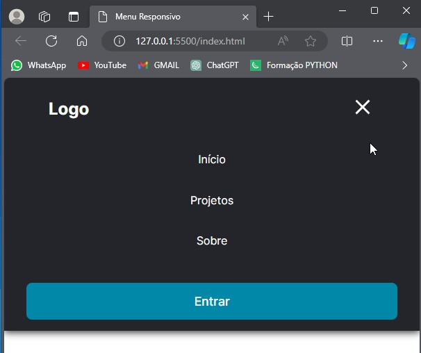
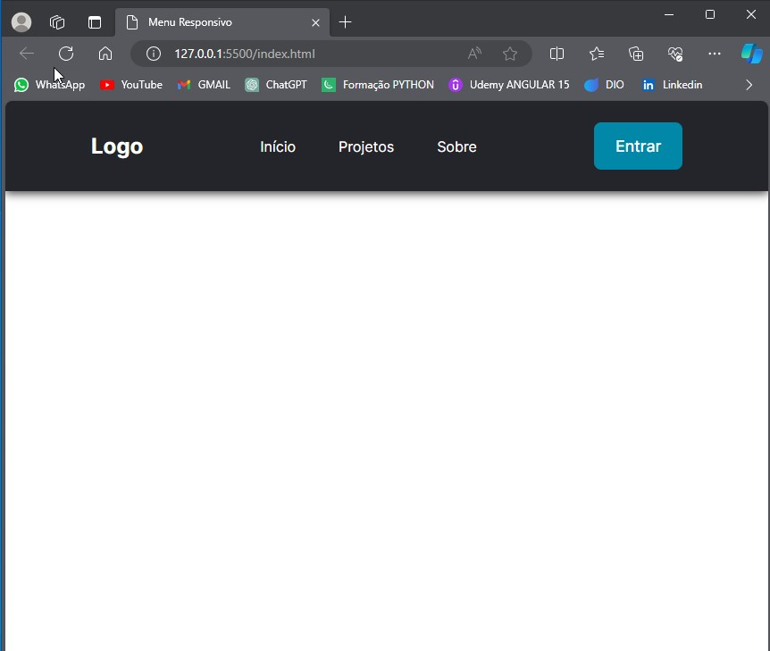
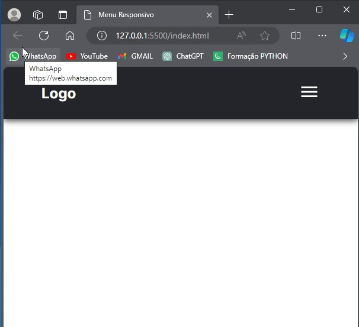

# Menu Responsivo





Descrição curta sobre o projeto.
---
## Sobre

Este é um projeto de menu responsivo desenvolvido utilizando HTML, CSS e JavaScript pelo [4ndreDev](https://github.com/4ndreDev). O menu é projetado para ser amigável em dispositivos móveis, adaptando-se à tela conforme necessário.
---
## Tecnologias

- HTML
- CSS
- JavaScript

---

## Como Usar

1. Clone o repositório:

```bash
git clone https://github.com/seu-usuario/seu-repositorio.git

Abra o arquivo index.html no seu navegador.

Interaja com o menu responsivo e experimente a funcionalidade.
